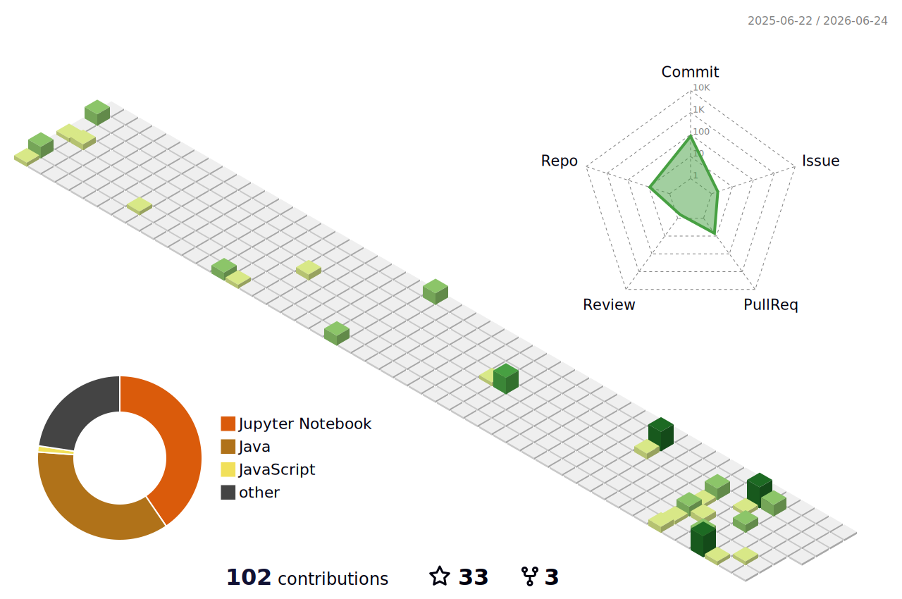

#  Hey, I'm Sai Krishna Founder @ Path4DSA

 

## About Me

I’m passionate about Artificial Intelligence, Machine Learning, Deep Learning, and Generative AI, with a strong focus on building impactful real-world applications.

As the Founder of **Path4DSA**, I aim to help students and developers improve their problem-solving skills, stay consistent, and grow through free learning resources and daily coding practice.

I enjoy working on scalable web applications, intelligent systems, and developer-focused products while continuously exploring modern technologies and improving my skills.

### Core Areas

- Data Structures & Algorithms
- Full Stack MERN Development
- AI, ML & Generative AI
- Problem Solving
- Scalable Web Applications
- System Design

# About Path4DSA

 

<table>
<tr>
<td width="60%" valign="top">

Path4DSA is a growing developer community focused on helping students improve in:

- Data Structures & Algorithms  
- Full Stack Development  
- Interview Preparation  
- Daily Problem Solving  
- AI & Modern Technologies  

We regularly share coding questions, developer resources, interview preparation material, and learning content to help students stay consistent and improve every day.

### What We Do

- Daily Coding Questions  
- DSA & Development Content  
- Free Learning Resources  
- Community Driven Learning  
- Consistency Focused Growth  

</td>

<td width="40%" align="center">

</td>
</tr>
</table>

 

### Connect With Path4DSA

 

  

 

### Follow Path4DSA and become part of a growing developer community.

Daily coding practice, interview preparation, development resources, and consistent learning.

# Tech Stack & Skills

## Programming Languages

  

## Frontend Development

  

## Backend Development

  

## Databases

  

## AI / ML

  

## Tools & Platforms

  

# Connect With Me

 

# GitHub Stats

<table align="center">
  <tr>
    <td align="center">
      
    </td>
    <td align="center">
      
    </td>
  </tr>
</table>

<table align="center">
  <tr>
    <td align="center">
      
    </td>
    <td align="center">
      
    </td>
  </tr>
</table>

# Let's Build Together

I’m always excited to connect with developers, creators, and innovators who enjoy building impactful products and exploring new technologies.

### Sai Krishna
AI • ML • Gen AI • Full Stack Development

